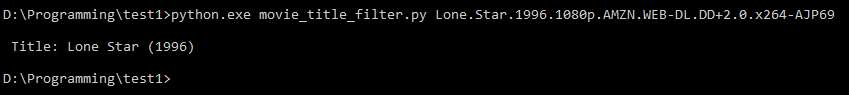
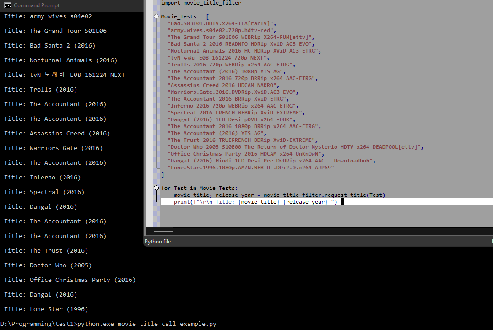
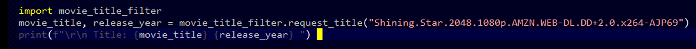

# movie_title_filter
Filter out common text formatting from a movie file.  Returns a simplified output with a date, if it has one.

* First strips out all of the brackets.
* Searches through the title string, and looks for the "date".   
  ie. a date between 1920 and 2050.  
  Function returns an array of the date(s) found and picks the last one.
* If a date was found, parse out the title left of the date.
* No date? Parses out codecs, video codecs, resolutions, and provide a result. 
